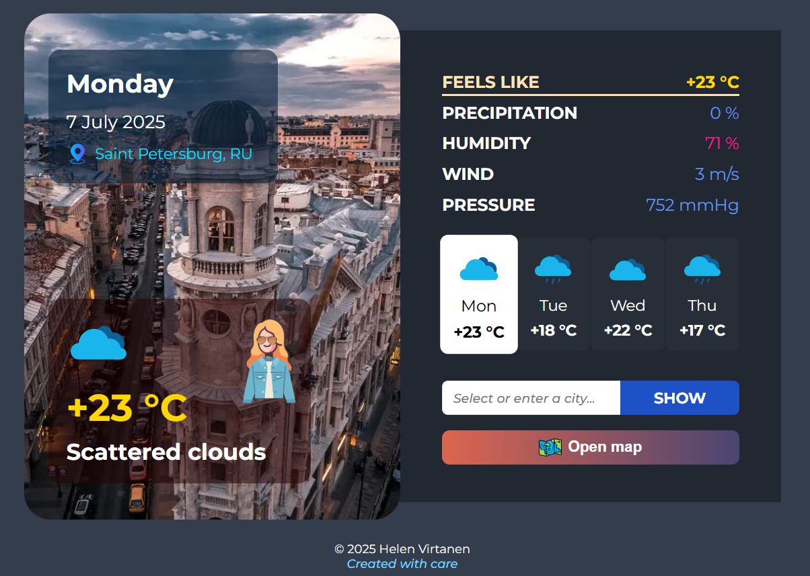
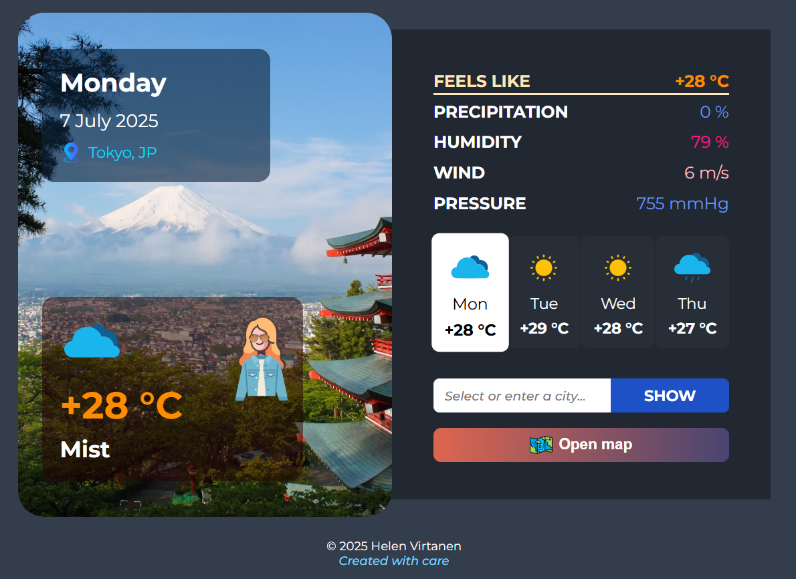
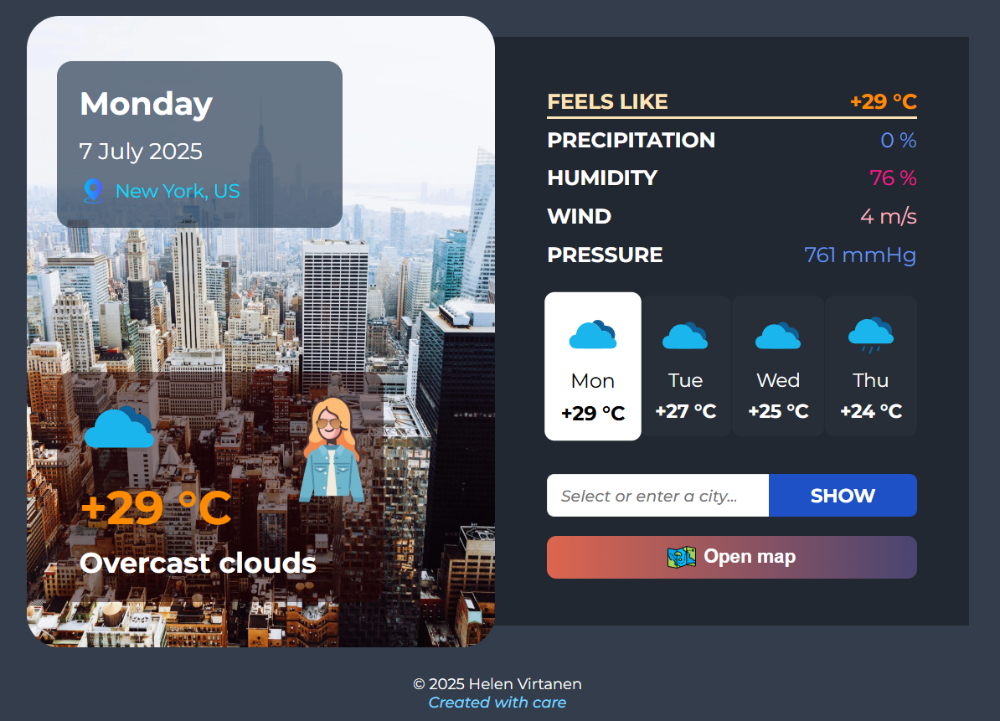

# Прогноз погоды Friendly Forecast 🌞🌎

[Репозиторий в GitHub](https://github.com/HelenVirtanen/weather-forecast-app)

[Посмотреть на GitHub Pages](https://helenvirtanen.github.io/weather-forecast-app/)

## 📖 Описание проекта: 
Приложение "Friendly Forecast" позволяет узнать погоду в любой точке мира на сегодняшний день и на 3 дня вперед.

### Особенности приложения
Для большей информативности для пользователя о погоде добавлено следующее:
1) совет-подсказка, что надеть/взять с собой (зонт, крем от солнца, очки, шапку/шарф и т.д.).
2) расширенные данные о погоде (температура по ощущению, вероятность осадков, уровень влажности, скорость ветра, атмосферное давление);
3) данные погоды, которые выходят __за рамки нормы__ подсвечены цветом (зеленым - ниже нормы, розовым/красным - выше нормы). 
Синим цветом отражаются данные в диапазоне __нормы__.
4) температуре соответствует конкретный цвет (холодные оттенки синего - для минусовой, белый - для нуля, от светлого желтого до красного - для плюсовых температур)
5) поиск возможен через форму/карту
6) некоторым наиболее популярным городам мира добавлены свои картинки для фона. Для остальных применяется дефолтный фон.

## Элементы интерфейса приложения:
* __левая панель__: 
  - текущая дата, день, место с международным кодом;
  - температура воздуха, общее описание погоды, иконка для визуализации состояния погоды и картинка-совет

* __правая панель__: 
  - список данных: температура воздуха по ощущению, вероятность осадков, уровень влажности, скорость ветра, атмосферное давление;
  - список дней (текущего и следующих трех) с указанием температуры и иконки-описания погоды;
  - форма поиска и кнопка Show (Показать);
  - кнопка для открытия карты и выбора интересуемой точки;

* __футер__: год, имя фамилия автора, слоган

## 🖼️ Скриншоты
### Главная по дефолту


### Прогноз погоды в выбранном городе (пример, Токио)


### Пример отображения характеристик погоды цветом (пример, Нью-Йорк)


## ⚙️ Суть работы скрипта:
* автоматически обновляются данные по текущему дню и следующим дням при получении реультатов поиска;
* установлены по дефолту текущие дата и день; 
* данные погоды обновляются каждые 3 часа;
* поиск осуществляется через форму поиска либо с помощью карты;
* подставляется нужный фон по выбранному месту, картинка-совет, иконки с общим описанием погоды;
* скролл вверх на высоту хедера при клике на якорные ссылки;

## 🛠️ Применяемые технологии
* HTML
* CSS
* JS
* API OpenWeather

## 🚀 Установка и запуск
**Клонирование репозитория**
```https://github.com/HelenVirtanen/weather-forecast-app.git```

**Открытие проекта**
1) VS Code -> нажать Go Live (для этого должен быть установлен плагин Live Server)
2) GitHub Pages -> https://helenvirtanen.github.io/weather-forecast-app/

## 💡 Планы по развитию
Для улучшения пользовательского опыта и эстетики есть идеи добавить: 
1) большее количество фонов для конкретных городов/стран (например, по коду страны)
2) альтернативные иконкам-советам с девушкой иконки-советы с парнем 
3) языковой переключатель (ru/en)
4) несколько вариантов цветовых тем, в т.ч. для людей с особенностями цветового зрения;
5) открытие карты по нажатию на текущее место в левой панели
