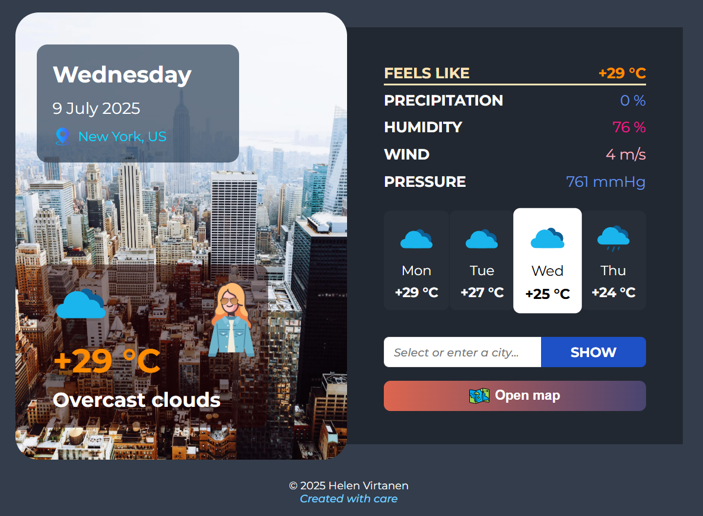

📑 Читать на [русском языке  🇷🇺](README.ru.md)

---

# Friendly Forecast Weather App 🌞🌎

[GitHub Repository](https://github.com/HelenVirtanen/weather-forecast-app)  
[View on GitHub Pages](https://helenvirtanen.github.io/weather-forecast-app/)

## 📖 Project Description
The **"Friendly Forecast"** app shows you the weather anywhere in the world for today and the next 3 days.

### 🌟 Key Features
* 🧥 Clothing and accessory advice: umbrella, sunscreen, hat, etc.
* 📊 Detailed weather data: "feels like" temperature, precipitation probability, humidity, wind, pressure.
* 🎨 Color-coded anomalies:
  * green — below normal,  
  * blue — within normal,  
  * pink/red — above normal.
* 🌡️ Temperature palette: from cold blues to warm reds.
* 🔍 Search via form and map.
* 🖼️ Unique background images for popular cities; default background for others.

## 🧭 Interface Overview
🔹 **Left panel**:
  - Current date, day, location (with international code);  
  - Air temperature, general description, weather icon and suggestion image.

🔸 **Right panel**:
  - Detailed weather data: "feels like", precipitation, humidity, wind speed, atmospheric pressure;  
  - List of 4 days (current + next 3) with temperature and icons;  
  - Search form and "Show" button;  
  - Map open button.

🔻 **Footer**: year, author name, slogan.

## 🖼️ Screenshots
### Default view


### Forecast in selected city (e.g., Tokyo)


### Weather forecast for another day (e.g., New York, day after tomorrow)


## ⚙️ Script Behavior
* Weather data updates automatically for today and the next days when searching;
* Current date and day are shown by default;
* Forecast updates every 3 hours;
* Search available via form and map;
* Background, suggestion, and icons are selected automatically based on location and forecast;
* Smooth scroll to top when clicking anchor links.

## 🛠️ Technologies Used
* HTML  
* CSS  
* JS  
* OpenWeather API

## 🚀 Installation and Launch
**Clone the repository**
```bash
https://github.com/HelenVirtanen/weather-forecast-app.git
```

**Open the project**
1) In VS Code → click Go Live (requires Live Server extension)
2) Or via GitHub Pages → https://helenvirtanen.github.io/weather-forecast-app/

## 💡 Planned Improvements
To improve UX and visual appeal, here are some ideas:
1) More backgrounds for specific cities/countries (e.g., by country code);
2) Alternative suggestion icons with a male character;
3) Language switcher (ru/en);
4) Multiple color themes, including for colorblind users;
5) Open map by clicking current location in the left panel.
